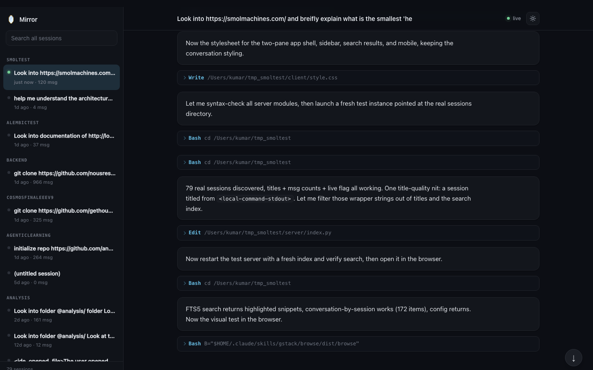

# 🪞 Mirror

A live, searchable HTML workspace for your Claude Code conversations. Keep working in
the terminal; Mirror prints a localhost link, and that page shows every session as a
clean, auto-updating document with a session switcher and full-text search.

- **No API cost.** Mirror never calls an LLM. It renders the transcript your session
  already writes to disk, so it rides on the Claude Code subscription you already have.
- **Localhost only.** The server binds to `127.0.0.1`. Your transcripts (which can hold
  secrets, file contents, and tool output) never leave your machine.
- **Multi-session.** A sidebar lists every session, grouped by project, with the live
  one marked. Click any session to read it.
- **Search.** Full-text search across all your sessions (SQLite FTS5 under the hood,
  with a graceful fallback). Click a result to jump to the match.
- **Zero dependencies.** Pure Python 3 standard library on the server. No `pip`, no `npm`.



## Requirements

- [Claude Code](https://claude.com/claude-code)
- Python 3.8+ (preinstalled on macOS and most Linux)

## Install

Clone the repo:

```bash
git clone https://github.com/anoopbhat44/mirror.git
```

Then load it as a plugin. For local use, point Claude Code at the directory:

```bash
claude --plugin-dir /path/to/mirror
```

To install it permanently via a local marketplace:

```bash
claude plugin marketplace add /path/to/mirror
claude plugin install mirror
```

After editing plugin files during development, run `/reload-plugins` inside Claude Code.

## Usage

1. Start Claude Code as you normally would.
2. Mirror prints a link on session start:
   ```
   🪞 Mirror live view: http://localhost:7842
   ```
3. Open the link. The page renders the conversation and updates after every turn.
4. Use the sidebar to switch between any of your sessions, and the search box to find
   anything across all of them.

That is the whole thing. Nothing else to run.

## Configuration (optional)

Mirror works with no config. To change defaults, create `~/.mirror/config.json`:

```json
{
  "theme": "dark",
  "port": 7842,
  "auto_open": false
}
```

- `theme`: default client theme, `"dark"` or `"light"` (a per-browser toggle overrides it).
- `port`: preferred port; Mirror picks the next free one if it is taken.
- `auto_open`: open the browser automatically when the server starts.

## How it works

```
Claude Code  ──writes──>  transcript .jsonl   (free, no tokens)
     │
 SessionStart / Stop hooks  ──>  local Python server (127.0.0.1)
     │                              watches the transcript, serves JSON + SSE
     └─ prints the link              │
                                     v
                          browser page renders + live-updates
```

- The `SessionStart` hook starts a small server (or reuses a running one) and prints
  the link.
- The server watches the active transcript and pushes an update (Server-Sent Events)
  whenever it changes; the browser re-renders incrementally, preserving your scroll and
  any tool calls you expanded.
- For the sidebar and search, the server keeps a small SQLite index derived from the
  transcripts under `~/.claude/projects`. It is a rebuildable cache, never the source of
  truth: delete `~/.mirror/index.db` and it rebuilds.

## Privacy

Everything is local. The server only listens on `127.0.0.1`, so the page is reachable
only from your machine. Mirror does not send your transcripts anywhere. Public sharing is
a planned later feature and will be explicit and redacted (see [ROADMAP.md](ROADMAP.md)).

## Roadmap

v1 is the local live view; v2 is the local workspace (multi-session, search, config),
which this build includes. Later versions add artifacts, opt-in public sharing, and team
features. See [ROADMAP.md](ROADMAP.md).

## License

MIT. See [LICENSE](LICENSE).

Bundled third-party libraries in `client/vendor/` ([marked](https://github.com/markedjs/marked)
and [highlight.js](https://github.com/highlightjs/highlight.js)) are MIT licensed and used
for client-side rendering only.
